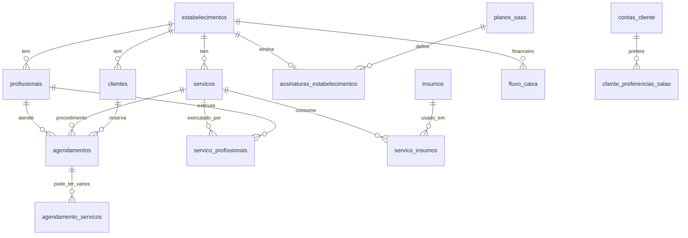

# AgendaGlow — Schema do banco de dados

Referência das tabelas PostgreSQL aplicadas pelas migrações em `migrations/`.

## Visão geral (multi-tenant)



## Migrações (ordem)

| Arquivo | Conteúdo |
|---------|----------|
| `000001` | Profissionais, serviços, adicionais, agendamentos |
| `000002` | Fluxo de caixa |
| `000003` | Clube de assinatura (planos + assinantes) |
| `000004` | Clientes + origem do agendamento |
| `000005` | Multi-tenancy (`estabelecimentos`, slug) |
| `000006` | Logo do salão |
| `000007` | Planos SaaS + assinaturas dos salões |
| `000008` | Status de pagamento de comissões |
| `000009` | Encaixe `EM_APROVACAO` + e-mail profissional |
| `000010` | Expedientes (`expedientes_profissionais`) |
| `000011` | Usuários (`users`) com roles |
| `000012` | Seed Super Admin |
| `000013` | Seed tenant dev |
| `000014` | Nome único em planos SaaS |
| `000015` | Especialidades |
| `000016` | Secretaria, fila, insumos, cobrança, `pendente_aprovacao` |
| `000017` | Schema completo do domínio (CRM, catálogo, financeiro estendido) |
| `000018` | Estado da integração oficial do WhatsApp |
| `000019` | Permissão administrativa `whatsapp_enabled` e backfill de conectados |
| `000020` | Flag `whatsapp_enabled` / feature WhatsApp |
| `000021` | Fila de antecipação (`rodadas_antecipacao`, `ofertas_antecipacao`) |
| `000022` | Retentativa de envio (`proxima_tentativa_em`) |
| `000023` | `token_hash_anterior` (link já entregue continua válido) |
| `000024` | Horários de agenda da antecipação em `TIMESTAMP` (parede), alinhados a `agendamentos` |

## Tabelas por domínio

### Plataforma SaaS
- `planos_saas` — planos corporativos (preço, limite de profissionais)
- `assinaturas_estabelecimentos` — vínculo salão ↔ plano, vencimento, status
- `faturas_saas` — histórico de cobrança mensal (Super Admin)
- `users` — credenciais staff (SUPER_ADMIN, DONA, SECRETARIA, PROFISSIONAL)

### Salão (tenant)
- `estabelecimentos` — nome, slug, logo, endereço, bio, dona e integração WhatsApp
  (`whatsapp_enabled`, status, WABA, telefone e data de conexão)
- `especialidades` — cargos/áreas da equipe
- `profissionais` — equipe, comissão, expediente, perfil
- `expedientes_profissionais` — jornada por dia da semana
- `categorias_servicos` — agrupamento do catálogo
- `servicos` — procedimentos base
- `servico_adicionais` — variações de tempo/preço
- `servico_profissionais` — quem executa cada serviço
- `insumos` — estoque
- `servico_insumos` — ficha técnica (BOM)
- `clientes` — cadastro por salão (telefone único no tenant)
- `agendamentos` — reservas com status, cobrança, encaixe (`data_hora_*` em `TIMESTAMP` de parede)
- `rodadas_antecipacao` / `ofertas_antecipacao` — fila exclusiva de antecipação; `slot_*` e `*_snapshot` são `TIMESTAMP` (parede, iguais a `agendamentos`); instantes operacionais (`created_at`, `expira_em`, …) ficam `TIMESTAMPTZ`
- `agendamento_adicionais` — adicionais escolhidos
- `agendamento_servicos` — múltiplos serviços por agendamento
- `fila_espera` — clientes que aceitam adiantar horário
- `fluxo_caixa` — entradas, custos fixos, comissões
- `fechamento_dia_notas` — nota de fechamento diário da dona

### Clube de assinatura (por salão)
- `planos_assinatura` — planos do clube
- `clientes_assinantes` — assinantes com créditos de visita

### Cliente público (plataforma)
- `contas_cliente` — login global (telefone/e-mail únicos)
- `cliente_preferencias_salao` — profissional favorito por salão
- `cliente_notas_internas` — CRM interno
- `cliente_galeria` — fotos antes/depois

## Aplicar migrações

```bash
# Postgres rodando (ex.: porta 5435) + DATABASE_URL no .env
go run ./cmd/migrate
```

## Credenciais dev (após seeds 000012 + 000013 + 000016)

Ver `docs/REGRAS_NEGOCIO.md` §15.
